# **FGUI**

FairyGUI Editor is a Professional and intuitive UI editor  .

簡単に言えば、UIを作るための神ツールです。

## インストール

https://www.fairygui.com/download　からインストール

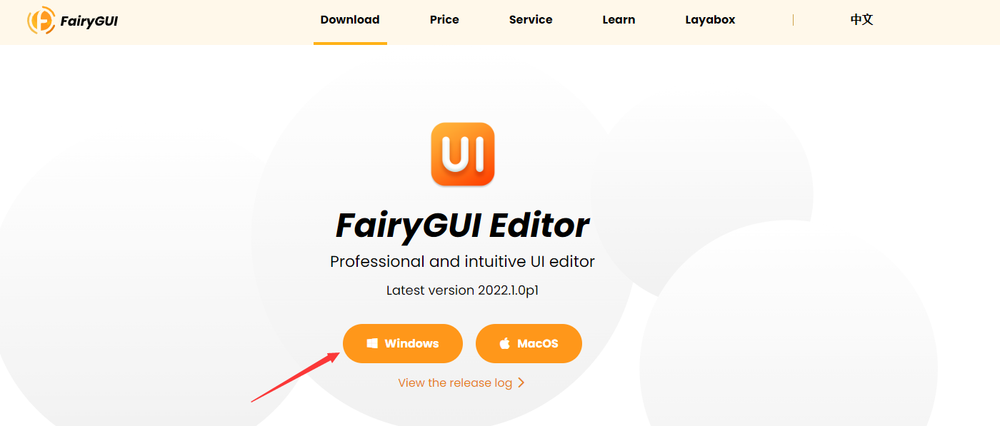

開きます。

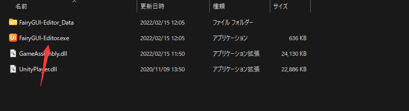

## 導入

新規プロジェクト

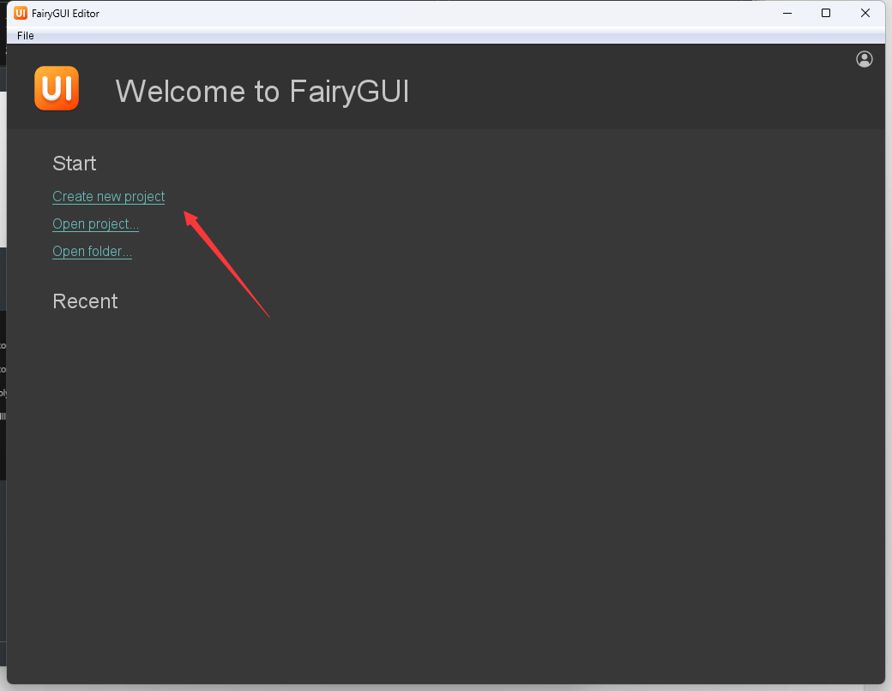

設定します。

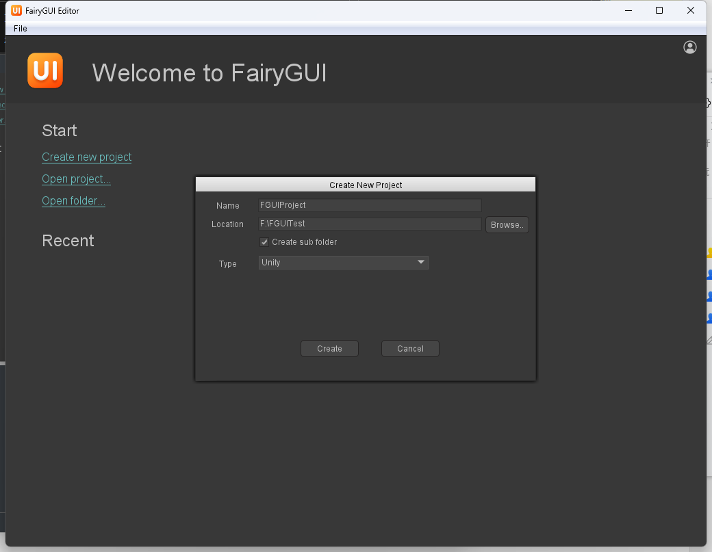

## 紹介

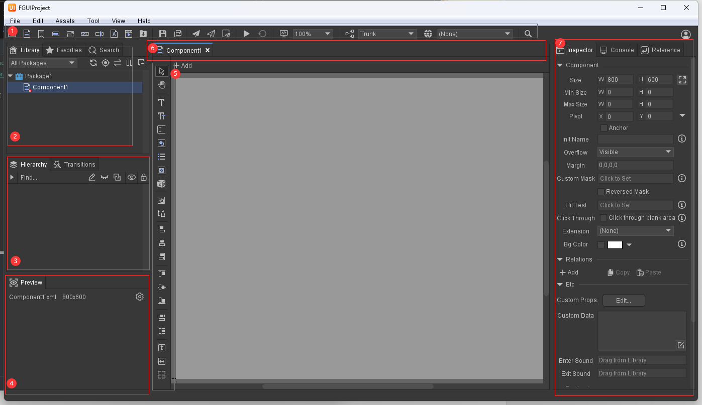

1.ショートカットボタンリストです。Component、Buttopnとかの作成、画面解像度の調整、テスト、とかの処理。

2.**Library**はPackageとPackageのComponent管理です。

**Favorites**は…Favoritesです、よく使うものは便利に確認。

Searchは**Library**のもの探す用です。

3.**Hierarchy**はこのcomponent中のエレメントリスト。

4.**Preview**、プレビュー用。

5.photoshopみたいな感じ、エレメント追加、変更とかの操作。

6.Tabです。他のTabに切り替えます。

7.具体的な機能調整。

## 先ずはFGUIで画面を作りましょう！

タイトルを作りたいの場合

1.まずは名前変更

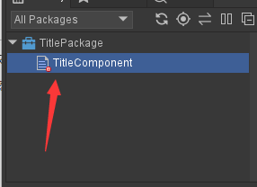

2.Textを作り出す

3.名前変更、サイズ調整、内容入力とか

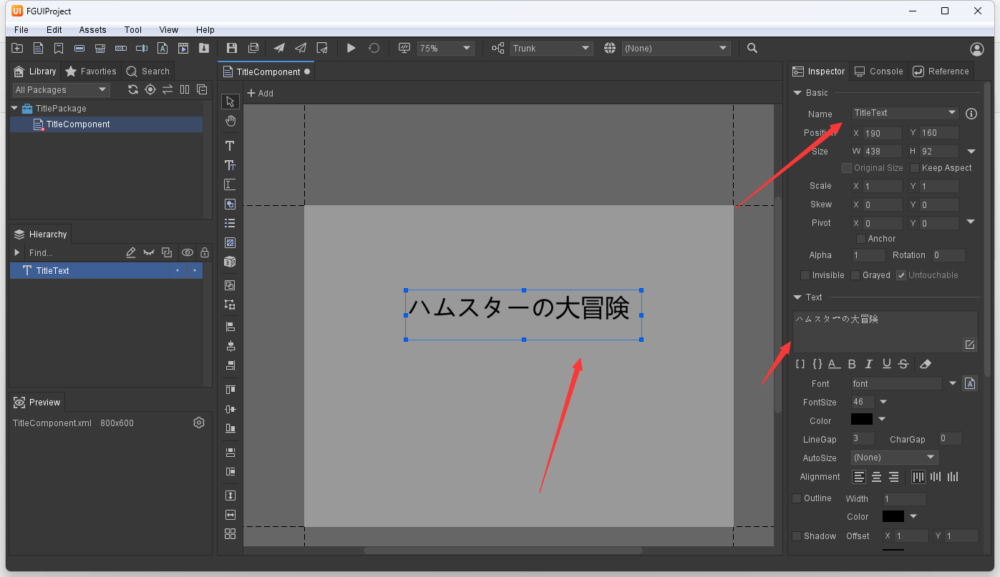

4.画像付き

素材はファイルに追加します。

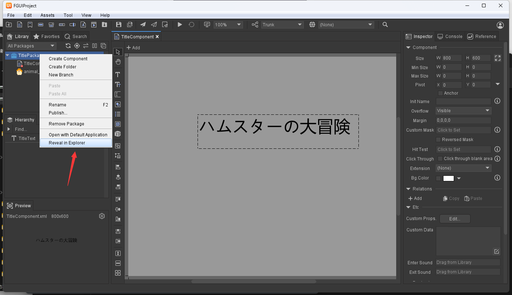

Refreshすればこんか感じ

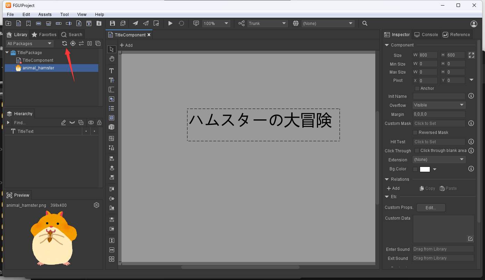

ドラッグして、サイズ調整

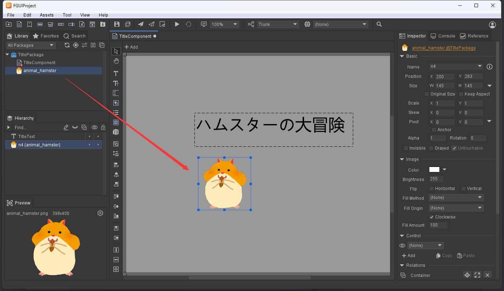

もう一匹追加

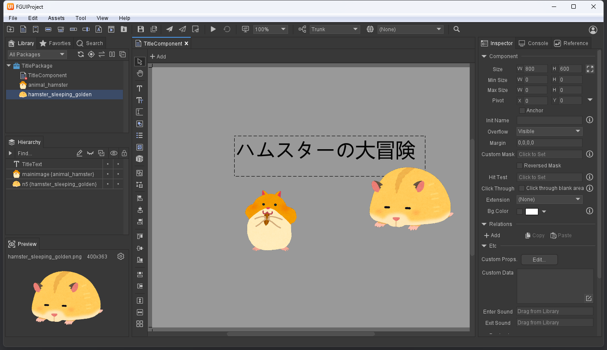

**Set Exported**、これ大事

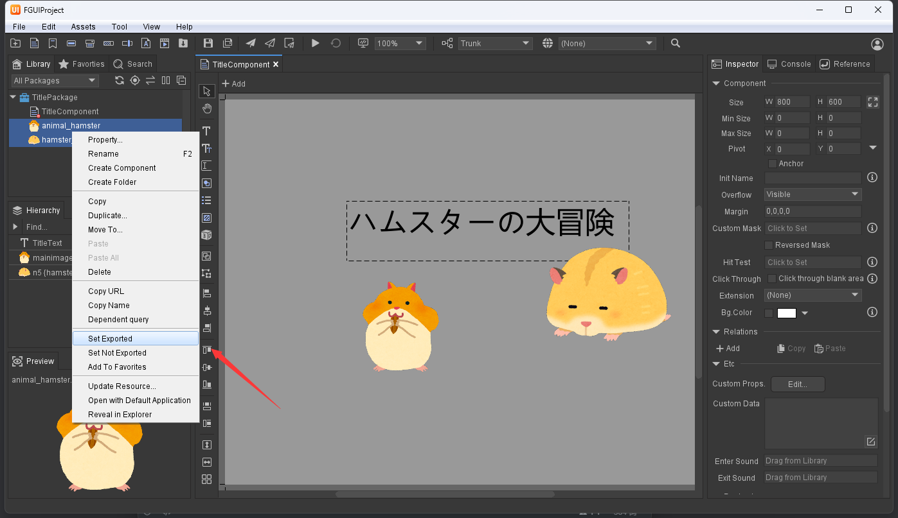

## FGUIから(Publish)導出する

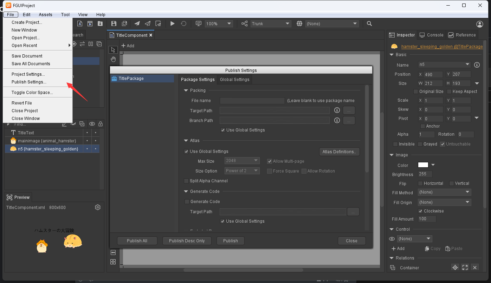

Package SettingのGenerate Code をチェック忘れず！ソースコード生成用。

Global Setting→PackingのTarget PathとGenerate CodeのTargetPathを設定して、Publishする。

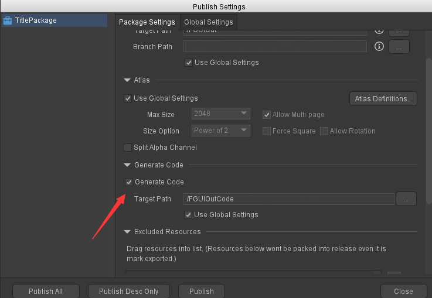

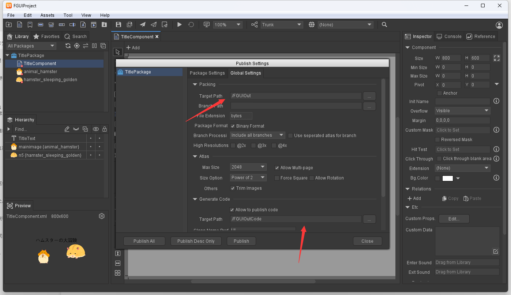

これでファイルに反映

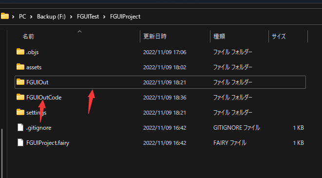

自動的にSprite Atlas化

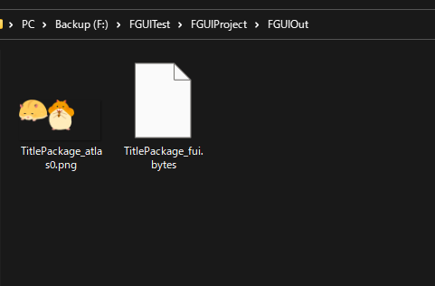

自動的に生成されたソースコード、Unity中に使える。

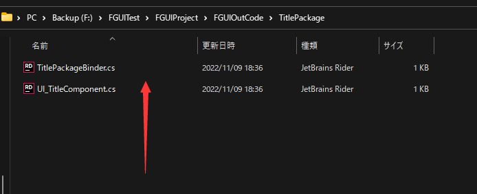

## Unityで反映

### 1.UnityでSDK入れる

https://github.com/fairygui/FairyGUI-unityからインストール

Asset内丸コピ

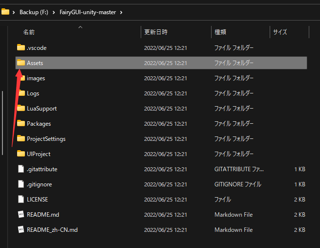

### 2.FGUIで生成ファイルはAseets内にコーピ

実際開発の時にはFGUIから生成パスはここに指定すればこの手順いらないです。

	

### 3.Unity中に表示

右クリックしてUICameraを選択、FGUI用のカメラを作りだす。

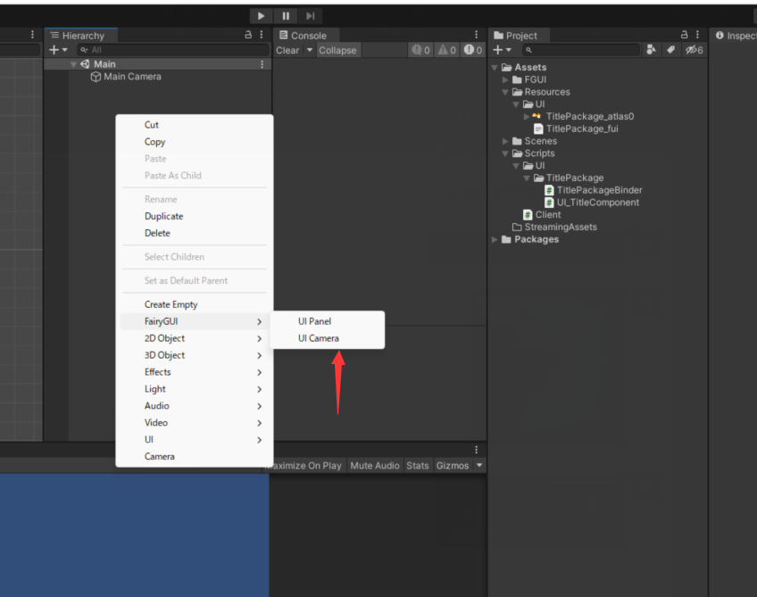

Tag調整

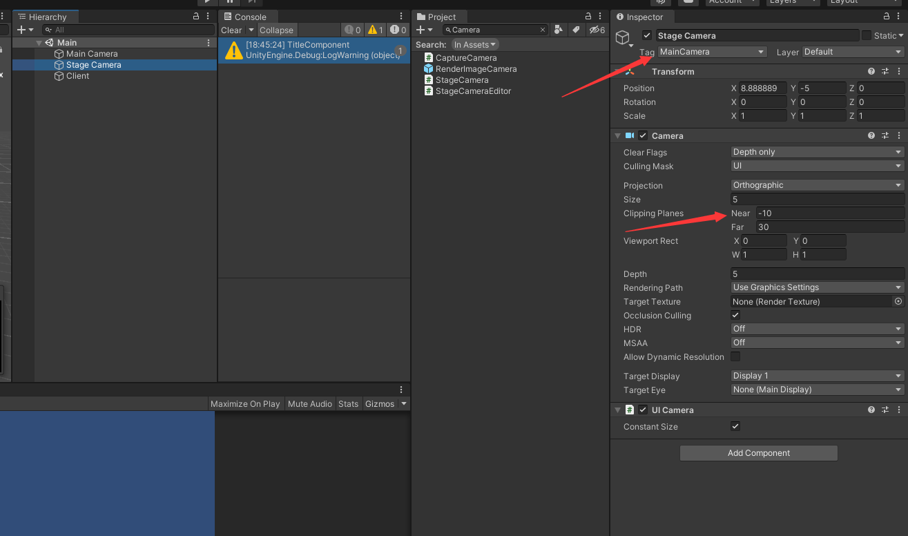

Todo

ソースコード部分